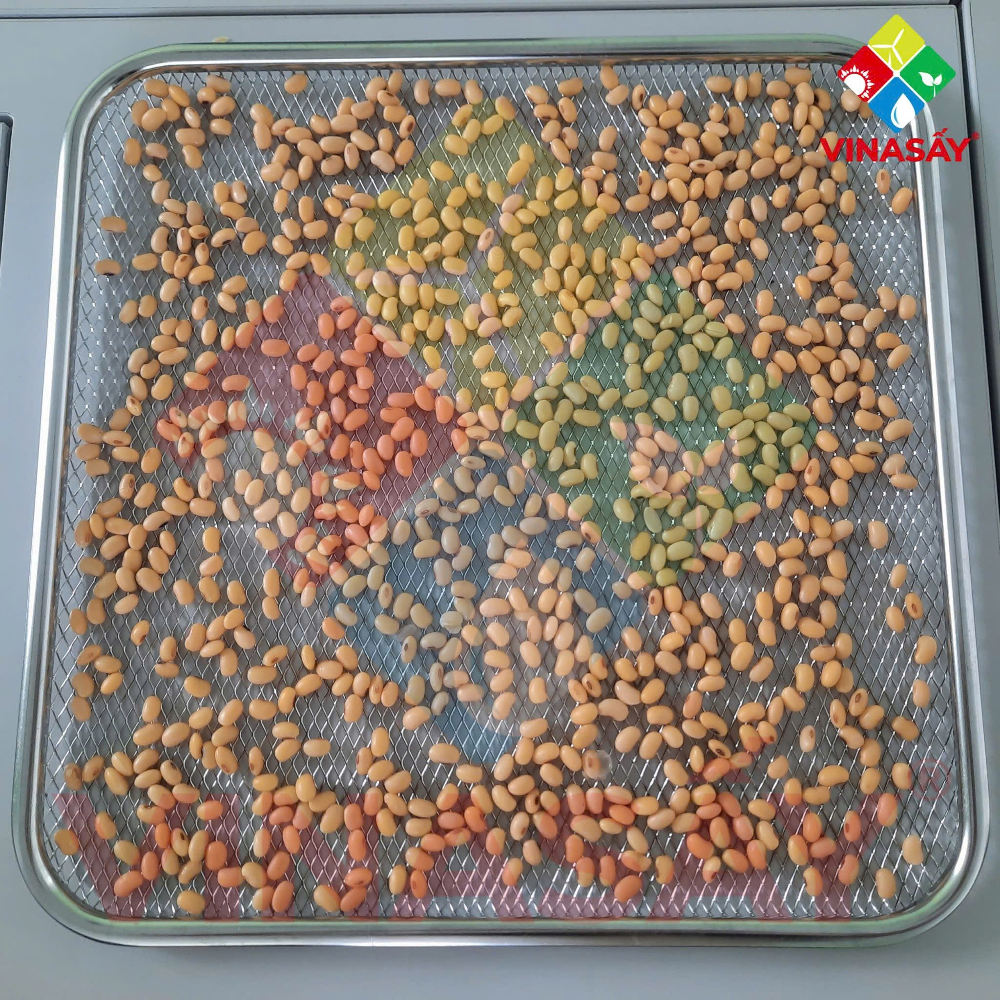
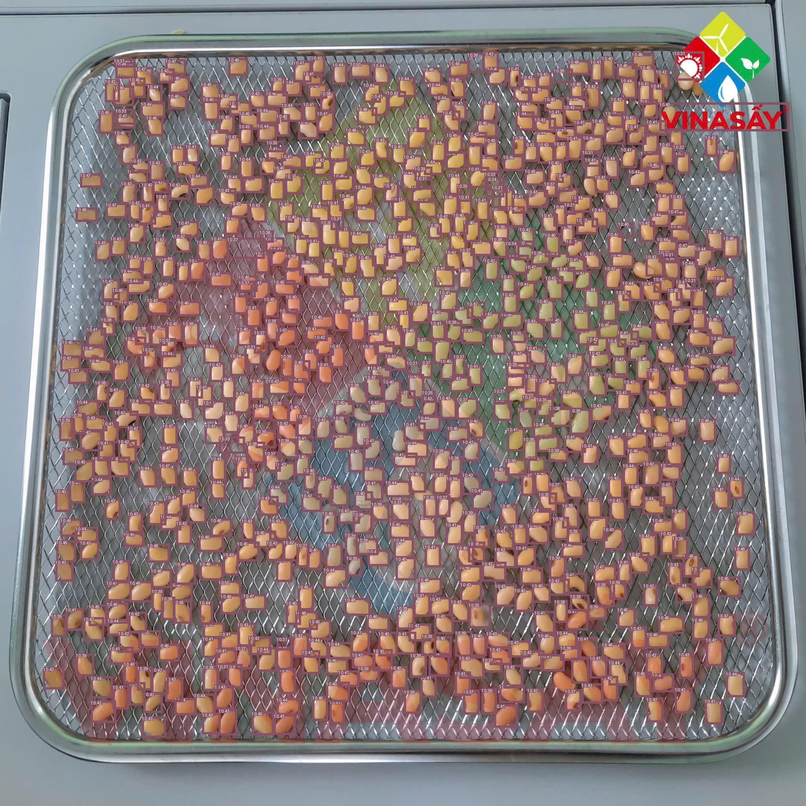

# Counting beans by T-rex

### How to set up

- Install required packages:
```bash
pip install -r requirements.txt
```

- Get T-rex token from [cloud-deepdataspace](https://cloud.deepdataspace.com/dashboard/token-key)

### How to generate prompt
```bash
python3 src/customize_embedding.py --token <token>
```

### How to inference with prompt
```bash
python3 src/embedding_inference.py --token <token>
```

### Result

#### Comparison of Images

| Original Image                                                             | Processed Image                                                                      |
|----------------------------------------------------------------------------|--------------------------------------------------------------------------------------|
|  |  |
